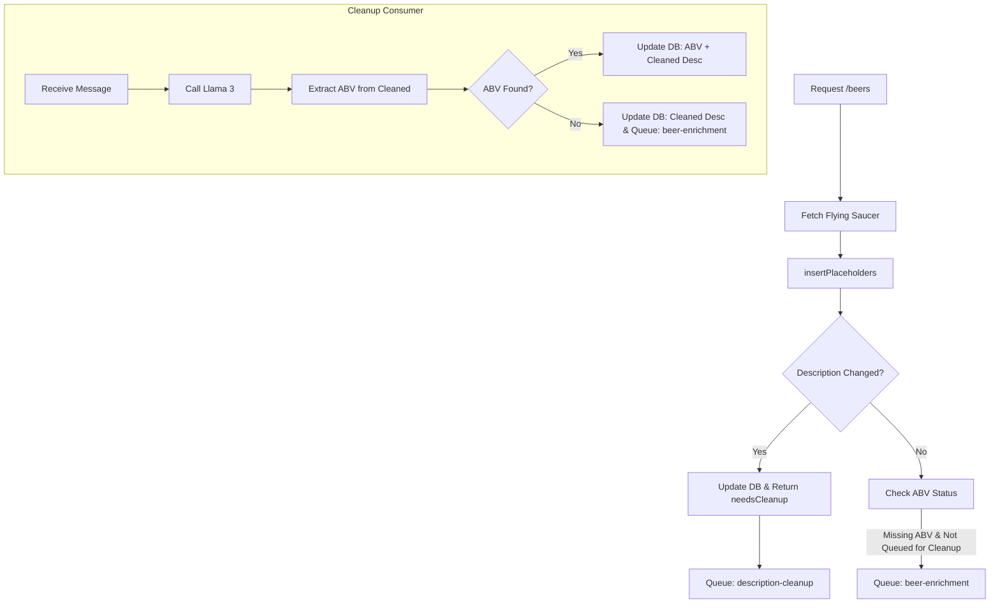

# Beer Description Cleanup Pipeline

## Overview

Clean up `brew_description` fields using a lightweight LLM inference call. Handles spelling errors, punctuation issues, and HTML artifacts without altering the original phrasing.

## Design Decisions

> [!NOTE]
> **Pipeline Ordering**: Cleanup runs in background BEFORE ABV extraction. The cleanup consumer is responsible for ABV extraction and only queues for Perplexity if ABV cannot be extracted from the cleaned description.

> [!NOTE]
> **No Double Queuing**: If a beer needs cleanup, it is NOT queued for Perplexity. The cleanup consumer handles the fallback to Perplexity if ABV extraction fails after cleanup.

> [!NOTE]
> **Storage**: Use D1 (`enriched_beers` table) for both cleaned descriptions and metadata. D1 storage cost is negligible (~1-5MB for 10K beers vs 5GB free tier).

---

## Why LLM vs. Libraries

- Domain-specific vocabulary (beer styles, hop varieties, brewery terms) makes traditional spellcheck unreliable
- Small models understand context and won't "correct" valid terms like Märzen, gose, or Citra
- Cost is negligible at scale

---

## Inference Provider

**Primary: Cloudflare Workers AI** (recommended)

| Provider       | Model                 | Cost              | Latency   | Notes                       |
| -------------- | --------------------- | ----------------- | --------- | --------------------------- |
| **Workers AI** | Llama 3.2 1B Instruct | ~$0.002/1M tokens | 20-50ms   | Smallest, fastest, cheapest |
| Workers AI     | Llama 3 8B            | $0.011/1M tokens  | 50-100ms  | Better quality, higher cost |
| Groq           | Llama 3.1 8B          | $0.05/1M tokens   | 100-200ms | External fallback           |

**Why Llama 3.2 1B:**

- Description cleanup is a simple task (spelling, punctuation, HTML)
- 1B model is sufficient - no complex reasoning needed
- ~5x cheaper and ~2x faster than 8B
- Can always upgrade to 8B if quality issues arise

Workers AI advantages:

- Native binding (no external network hop)
- Lower latency
- Integrated billing
- No API key management

Estimated cost for 10,000 descriptions: **$0.02** (Workers AI Llama 3.2 1B)

---

## Prompt

```
Clean up this beer description. Fix spelling errors, punctuation, and remove any HTML artifacts or entities.

IMPORTANT: Preserve all numeric values and their units exactly as written, especially percentages and ABV notations (e.g., "5.2%", "5.2 ABV").

Do not change the wording or add any new information. Return only the cleaned text.

Description: {brew_description}
```

---

## Database Schema

Extend `enriched_beers` table in D1:

```sql
ALTER TABLE enriched_beers ADD COLUMN brew_description_original TEXT;
ALTER TABLE enriched_beers ADD COLUMN brew_description_cleaned TEXT;  -- nullable
ALTER TABLE enriched_beers ADD COLUMN description_hash TEXT;
ALTER TABLE enriched_beers ADD COLUMN description_cleaned_at INTEGER;
ALTER TABLE enriched_beers ADD COLUMN cleanup_source TEXT;  -- 'workers-ai' | 'groq' | NULL
```

Quota tracking table:

```sql
CREATE TABLE IF NOT EXISTS cleanup_limits (
    date TEXT PRIMARY KEY,
    request_count INTEGER NOT NULL DEFAULT 0,
    last_updated INTEGER NOT NULL
);
```

---

## Pipeline Flow



### Key Flow Rules

1. **If description changed** → Queue for cleanup, NOT for Perplexity
2. **If description unchanged AND ABV missing** → Queue for Perplexity (cleanup already done or not needed)
3. **Cleanup consumer** is responsible for:
   - Cleaning description
   - Extracting ABV from cleaned text
   - If ABV found: Update DB, done
   - If ABV not found: Update DB with cleaned desc, THEN queue for Perplexity

This prevents wasted Perplexity API calls on beers that just needed description cleanup to extract ABV.

---

## Implementation

### Queue Configuration

```jsonc
// wrangler.jsonc additions
"queues": {
  "producers": [
    { "queue": "description-cleanup", "binding": "CLEANUP_QUEUE" }
  ],
  "consumers": [
    {
      "queue": "description-cleanup",
      "max_batch_size": 10,
      "max_concurrency": 1,
      "max_retries": 2,
      "retry_delay": 30
    }
  ]
}
```

### Updated `insertPlaceholders` Return Type

```typescript
export interface InsertPlaceholdersResult {
  totalSynced: number;
  withAbv: number;
  needsEnrichment: Array<{ id: string; brew_name: string; brewer: string }>;
  needsCleanup: Array<{ id: string; brew_name: string; brewer: string; brew_description: string }>;
}
```

### Updated `insertPlaceholders` Logic

```typescript
export async function insertPlaceholders(
  db: D1Database,
  beers: Array<{ id: string; brew_name: string; brewer: string; brew_description?: string }>,
  requestId: string
): Promise<InsertPlaceholdersResult> {
  const needsEnrichment: Array<{ id: string; brew_name: string; brewer: string }> = [];
  const needsCleanup: Array<{
    id: string;
    brew_name: string;
    brewer: string;
    brew_description: string;
  }> = [];

  for (const beer of beers) {
    const descriptionHash = beer.brew_description
      ? await hashDescription(beer.brew_description)
      : null;

    // Check if description changed
    const existing = await db
      .prepare('SELECT description_hash, abv FROM enriched_beers WHERE id = ?')
      .bind(beer.id)
      .first<{ description_hash: string | null; abv: number | null }>();

    const descriptionChanged = descriptionHash !== existing?.description_hash;

    if (descriptionChanged && beer.brew_description) {
      // Description changed - queue for cleanup, invalidate old cleaned version
      needsCleanup.push({
        id: beer.id,
        brew_name: beer.brew_name,
        brewer: beer.brewer,
        brew_description: beer.brew_description,
      });

      // Update DB: store original description, hash, null out cleaned
      await db
        .prepare(
          `
        INSERT INTO enriched_beers (id, brew_name, brewer, brew_description_original, description_hash, brew_description_cleaned, last_seen_at)
        VALUES (?, ?, ?, ?, ?, NULL, ?)
        ON CONFLICT(id) DO UPDATE SET
          brew_description_original = excluded.brew_description_original,
          description_hash = excluded.description_hash,
          brew_description_cleaned = NULL,
          description_cleaned_at = NULL,
          last_seen_at = excluded.last_seen_at
      `
        )
        .bind(
          beer.id,
          beer.brew_name,
          beer.brewer,
          beer.brew_description,
          descriptionHash,
          Date.now()
        )
        .run();
    } else if (existing?.abv === null) {
      // Description unchanged, but ABV still missing - queue for Perplexity
      needsEnrichment.push({
        id: beer.id,
        brew_name: beer.brew_name,
        brewer: beer.brewer,
      });
    }
    // else: description unchanged and ABV exists - nothing to do
  }

  return { totalSynced: beers.length, withAbv: 0, needsEnrichment, needsCleanup };
}
```

### Updated Handler (`src/handlers/beers.ts`)

```typescript
import { queueBeersForEnrichment, queueBeersForCleanup } from '../queue';

ctx.waitUntil(
  insertPlaceholders(env.DB, beersForPlaceholders, reqCtx.requestId)
    .then(async result => {
      // Queue for cleanup (these will NOT be queued for Perplexity yet)
      if (result.needsCleanup.length > 0) {
        await queueBeersForCleanup(env, result.needsCleanup, reqCtx.requestId);
      }

      // Queue for Perplexity (only beers that don't need cleanup)
      if (result.needsEnrichment.length > 0) {
        await queueBeersForEnrichment(env, result.needsEnrichment, reqCtx.requestId);
      }
    })
    .catch(err => {
      console.error(
        JSON.stringify({
          event: 'background_enrichment_error',
          requestId: reqCtx.requestId,
          error: err instanceof Error ? err.message : String(err),
        })
      );
    })
);
```

### Cleanup Consumer (`src/queue/cleanup.ts`)

```typescript
export async function handleCleanupBatch(
  batch: MessageBatch<CleanupMessage>,
  env: Env
): Promise<void> {
  for (const message of batch.messages) {
    const { beerId, beerName, brewer, brewDescription } = message.body;

    // Check quota before calling AI
    const quotaOk = await checkCleanupQuota(env.DB);
    if (!quotaOk) {
      console.log(`[cleanup] Quota exceeded, skipping ${beerId}`);
      // Fallback: try ABV extraction on original, queue for Perplexity if needed
      await handleFallback(env, beerId, beerName, brewer, brewDescription);
      message.ack();
      continue;
    }

    // Call Workers AI
    const { cleaned, usedOriginal } = await cleanDescriptionSafely(brewDescription, env.AI);

    // Extract ABV from cleaned description
    const abv = extractABV(cleaned);

    if (abv !== null) {
      // Success! Update DB with cleaned description AND ABV
      await env.DB.prepare(
        `
        UPDATE enriched_beers SET
          brew_description_cleaned = ?,
          description_cleaned_at = ?,
          cleanup_source = ?,
          abv = ?,
          confidence = 0.9,
          enrichment_source = 'description'
        WHERE id = ?
      `
      )
        .bind(cleaned, Date.now(), usedOriginal ? null : 'workers-ai', abv, beerId)
        .run();

      console.log(`[cleanup] ${beerId}: cleaned + ABV extracted (${abv}%)`);
    } else {
      // ABV not found - update cleaned description, queue for Perplexity
      await env.DB.prepare(
        `
        UPDATE enriched_beers SET
          brew_description_cleaned = ?,
          description_cleaned_at = ?,
          cleanup_source = ?
        WHERE id = ?
      `
      )
        .bind(cleaned, Date.now(), usedOriginal ? null : 'workers-ai', beerId)
        .run();

      // NOW queue for Perplexity enrichment
      await env.ENRICHMENT_QUEUE.send({
        beerId,
        beerName,
        brewer,
      });

      console.log(`[cleanup] ${beerId}: cleaned, no ABV found, queued for Perplexity`);
    }

    // Increment quota counter
    await incrementCleanupQuota(env.DB);
    message.ack();
  }
}

async function handleFallback(
  env: Env,
  beerId: string,
  beerName: string,
  brewer: string,
  originalDescription: string
): Promise<void> {
  // Try ABV extraction on original
  const abv = extractABV(originalDescription);

  if (abv !== null) {
    await env.DB.prepare(
      `
      UPDATE enriched_beers SET abv = ?, confidence = 0.9, enrichment_source = 'description'
      WHERE id = ?
    `
    )
      .bind(abv, beerId)
      .run();
  } else {
    // Queue for Perplexity
    await env.ENRICHMENT_QUEUE.send({ beerId, beerName, brewer });
  }
}
```

### Validation Function

```typescript
async function cleanDescriptionSafely(
  original: string,
  ai: Ai
): Promise<{ cleaned: string; usedOriginal: boolean }> {
  if (!original) return { cleaned: original, usedOriginal: true };

  let cleaned: string;
  try {
    const result = await ai.run('@cf/meta/llama-3.2-1b-instruct', {
      prompt: CLEANUP_PROMPT.replace('{brew_description}', original),
      max_tokens: 500,
    });
    cleaned = result.response.trim();
  } catch (e) {
    console.error('Cleanup inference failed:', e);
    return { cleaned: original, usedOriginal: true };
  }

  // Validation 1: ABV extraction should work the same or better
  const originalAbv = extractABV(original);
  const cleanedAbv = extractABV(cleaned);

  if (originalAbv !== null && cleanedAbv === null) {
    console.warn('Cleanup broke ABV extraction, using original');
    return { cleaned: original, usedOriginal: true };
  }

  // Validation 2: Length shouldn't change dramatically
  const lengthRatio = cleaned.length / original.length;
  if (lengthRatio < 0.5 || lengthRatio > 2.0) {
    console.warn('Cleanup changed length dramatically, using original');
    return { cleaned: original, usedOriginal: true };
  }

  return { cleaned, usedOriginal: false };
}
```

### Hash Function

```typescript
async function hashDescription(text: string): Promise<string> {
  const encoder = new TextEncoder();
  const data = encoder.encode(text);
  const hashBuffer = await crypto.subtle.digest('MD5', data);
  const hashArray = Array.from(new Uint8Array(hashBuffer));
  return hashArray.map(b => b.toString(16).padStart(2, '0')).join('');
}
```

---

## Quota Management

```typescript
const DAILY_CLEANUP_LIMIT = 1000;
const MONTHLY_CLEANUP_LIMIT = 5000;

async function checkCleanupQuota(db: D1Database): Promise<boolean> {
  const today = new Date().toISOString().split('T')[0];
  const result = await db
    .prepare('SELECT request_count FROM cleanup_limits WHERE date = ?')
    .bind(today)
    .first<{ request_count: number }>();

  return (result?.request_count ?? 0) < DAILY_CLEANUP_LIMIT;
}

async function incrementCleanupQuota(db: D1Database): Promise<void> {
  const today = new Date().toISOString().split('T')[0];
  await db
    .prepare(
      `
    INSERT INTO cleanup_limits (date, request_count, last_updated)
    VALUES (?, 1, ?)
    ON CONFLICT(date) DO UPDATE SET
      request_count = request_count + 1,
      last_updated = excluded.last_updated
  `
    )
    .bind(today, Date.now())
    .run();
}
```

---

## Error Handling

| Scenario                            | Action                                                                   |
| ----------------------------------- | ------------------------------------------------------------------------ |
| Inference call fails                | Use original description, try ABV extraction, queue Perplexity if needed |
| ABV extraction breaks after cleanup | Use original description                                                 |
| Length changes >2x                  | Use original description                                                 |
| Rate limit (429)                    | Retry with exponential backoff                                           |
| Quota exceeded                      | Skip cleanup, fallback to original + Perplexity                          |

---

## Files Summary

| File                    | Change                                                                |
| ----------------------- | --------------------------------------------------------------------- |
| `wrangler.jsonc`        | Add cleanup queue, AI binding                                         |
| `schema.sql`            | Add columns to enriched_beers, cleanup_limits table                   |
| `src/types.ts`          | Add CleanupMessage type                                               |
| `src/queue/cleanup.ts`  | NEW - cleanup consumer                                                |
| `src/queue/helpers.ts`  | Add queueBeersForCleanup function                                     |
| `src/queue/index.ts`    | Export new functions                                                  |
| `src/db/helpers.ts`     | Update insertPlaceholders to persist description, return needsCleanup |
| `src/handlers/beers.ts` | Wire up cleanup queue in background flow                              |

---

## Verification Plan

### Automated

- `npx tsc --noEmit` - Type safety
- `npx wrangler deploy --dry-run` - Build integrity

### Manual

1. Import beer with messy description containing ABV (e.g., "5.2% ABV IPA with typo")
   - Verify: Queued for cleanup, NOT Perplexity
   - Verify: After cleanup, ABV extracted, NOT queued for Perplexity

2. Import beer with messy description WITHOUT ABV
   - Verify: Queued for cleanup
   - Verify: After cleanup, ABV not found, THEN queued for Perplexity

3. Import same beer again (unchanged description)
   - Verify: NOT queued for cleanup (hash matches)

4. Verify quota limits are enforced
   - Hit daily limit, verify fallback to original + Perplexity

5. Verify validation rejects bad cleanups
   - Mock LLM returning truncated response, verify original is used
