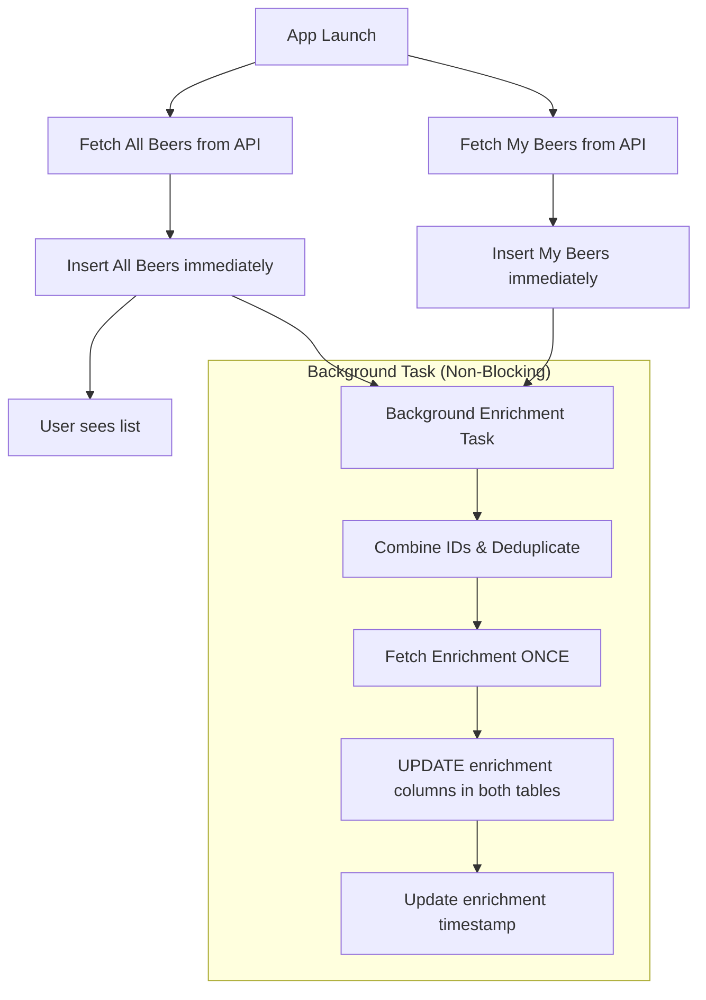

> **Note**: This document describes the original design. `initializeBeerDatabase` and
> `enrichBeersInBackground` have been removed. See `plans/abv-data-quality-fix-plan.md`
> for the current architecture.

# Non-Blocking Enrichment on App Initialization

## Problem Statement

Currently, the enrichment fetch during app initialization is **blocking**, adding ~100-500ms to startup time. Users must wait for both the beer API fetch AND the enrichment API fetch before seeing any data.

---

## Proposed Flow (Non-Blocking Enrichment)

Total blocking time: **~300-500ms** (enrichment adds 0ms to startup).

---

## Staged Implementation Plan

Due to the complexity of the changes, the implementation is broken into three staged phases. Each file is sized for easy processing by an AI agent.

### 1. [Phase 1: Foundation](./nonblock-phase1-foundation.md)

- Define `EnrichmentUpdate` types.
- Implement `updateEnrichmentData()` in repositories.
- Update database locking mechanisms.
- Add preference tracking for enrichment timestamps.

### 2. [Phase 2: Implementation](./nonblock-phase2-implementation.md)

- Create the unified `enrichBeersInBackground` logic.
- Refactor `initializeBeerDatabase` to follow the non-blocking pattern.
- Optimize app startup sequence.

### 3. [Phase 3: Advanced & Testing](./nonblock-phase3-advanced-testing.md)

- Optional: Abort Controller for background tasks.
- Worker-side admin endpoint for manual re-enrichment.
- **Comprehensive Testing & Verification Plan.**
- Rollback strategies.

---

## Success Criteria

1. App startup time reduced by ~100-300ms.
2. Beer list displays immediately after API fetch (before enrichment).
3. Enrichment data appears in database within 2-3 seconds.
4. No duplicate API calls for overlapping beers.
5. No race conditions or data corruption.
6. Enrichment timestamp properly tracked.
