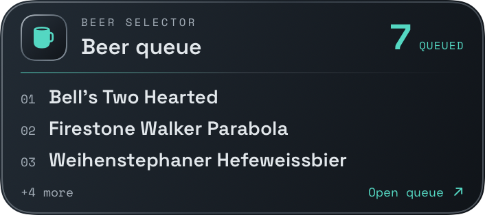

# Live Activity chrome — 2026-09-12

The native extension now uses the app's dark steel/cyan visual language: inset mug emblem, Space Grotesk/Space Mono typography, prominent queue count, numbered beer rows and an overflow/open-queue footer. The compact Island uses one mug and a count; the expanded presentation has separate leading/trailing regions and a bottom list. Saved/stale content gets an amber refresh prompt. No estimated wait time or preparation status is invented.

The views are shared between the widget and the Debug preview, but the preview gallery is not an OS-hosted ActivityKit screenshot. [Island content gallery](Screenshots/live-activity-island-preview.png). The data/attribute schema, queue submission, expiry and deep-link destination remain unchanged. Custom fonts are bundled and registered in the extension.

## Layout and accessibility

- Lock Screen shows up to three beers, two at larger standard sizes, and one at XXXL/accessibility sizes. Overflow is explicit at standard sizes; VoiceOver includes the overflow count at all sizes.
- Full displayed beer names are included in accessibility labels even when visually truncated. The entire Lock Screen card opens Beerfinder.
- Default gradients have no glow/animation. Reduced-luminance rendering softens the chrome edge and count accent. Physical Always-On contrast still needs visual acceptance on a device.
- SwiftUI ImageRenderer measured the actual Lock Screen view at 320/353/390-point widths across all 12 Dynamic Type sizes. All 36 seven-beer cases fit; maximum natural height 157 points. This measures view content, not OS hosting or the actual camera cutout.

## Local review

Xcode previews in `Widget/BeerQueueWidgetLiveActivity.swift` cover Lock Screen one/three/five beers and compact/expanded Island.

For isolated app rendering, use Debug launch argument `--preview-activity-style`; add `--preview-island` for the Island content gallery. This bypasses account loading/network monitoring and does not start a Live Activity. The gallery renders the shared views and writes measurements under the app's temporary `activity-style-preview` directory. It is unavailable in Release.

Evidence: `/private/tmp/BeerSelectorNative-activity-style/sizes.json`, simulator screenshots in the same directory, `/private/tmp/activity-style-preview.log`, `/private/tmp/activity-island-preview.log`. Build/test logs use `/private/tmp/BeerSelectorNative-activity-style-{build,device,tests}.log`.

## Apple references

[Creating custom views for Live Activities](https://developer.apple.com/documentation/activitykit/creating-custom-views-for-live-activities) documents the fixed black Dynamic Island background, custom Lock Screen background/action tint, and reduced-luminance handling. [Live Activities guidance](https://developer.apple.com/design/human-interface-guidelines/live-activities) describes glanceable layouts and visual identity. [Displaying live data](https://developer.apple.com/documentation/activitykit/displaying-live-data-with-live-activities) notes possible truncation beyond 160 points.
